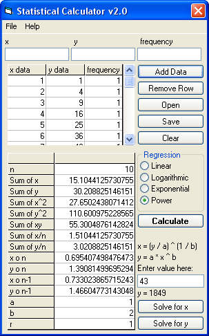

## Statistical Calculator v2\.0

### Description

Shows the mean, median, mode, variance, sum, standard deviation, average deviation, coefficient of deviation, total, square total, and variance for an array of values using either the population or sample method. Computes any of four different types of regression models (Linear, Logarithmic, Exponential, or Power). Includes an equation solver for both x and y data.
 
### More Info
 
2-point variable data entry. And one frequency data entry field.

             |
---                |---
**Submitted On**   |2003-09-10 21:55:58
**By**             |[Joshua Robertson](https://github.com/Planet-Source-Code/PSCIndex/blob/master/ByAuthor/joshua-robertson.md)
**Level**          |Advanced
**User Rating**    |4.9 (39 globes from 8 users)
**Compatibility**  |VB 6\.0
**Category**       |[Math/ Dates](https://github.com/Planet-Source-Code/PSCIndex/blob/master/ByCategory/math-dates__1-37.md)
**World**          |[Visual Basic](https://github.com/Planet-Source-Code/PSCIndex/blob/master/ByWorld/visual-basic.md)
**Archive File**   |[Statistica1644169112003\.zip](https://github.com/Planet-Source-Code/joshua-robertson-statistical-calculator-v2-0__1-48411/archive/master.zip)

